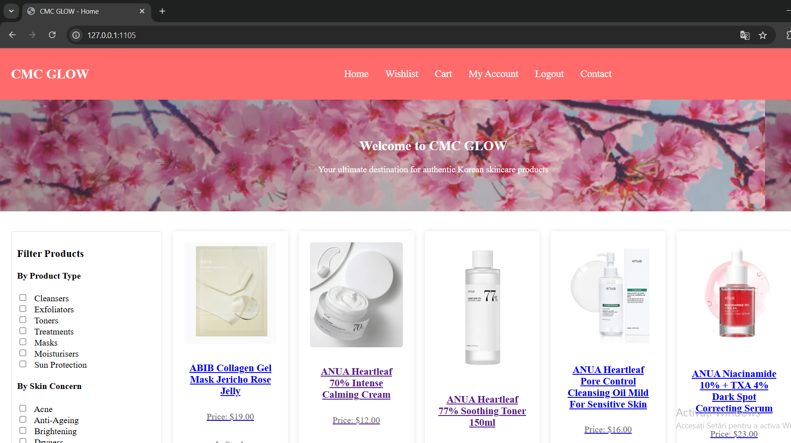
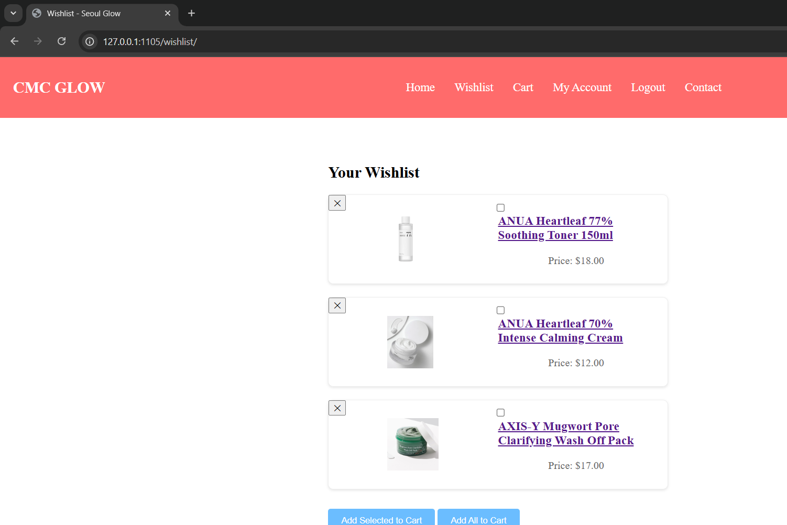
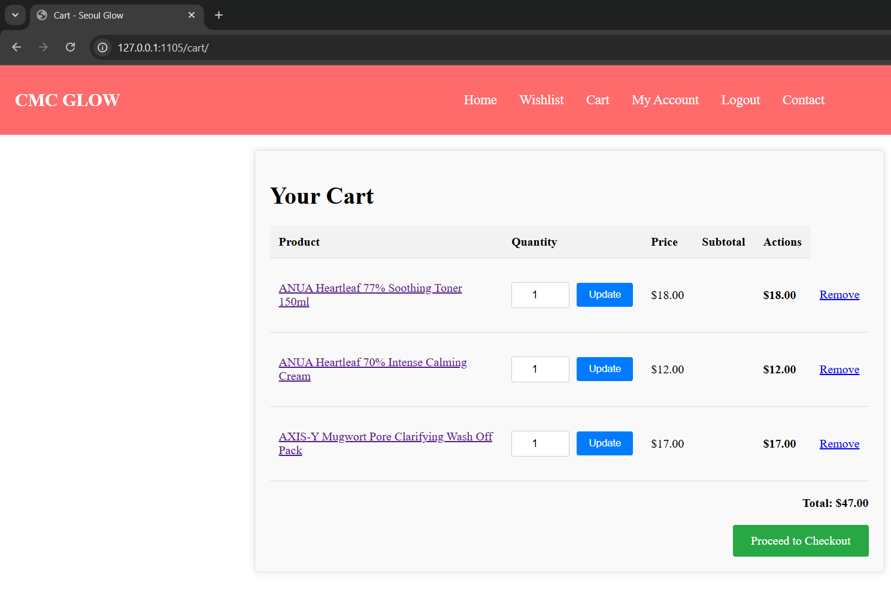
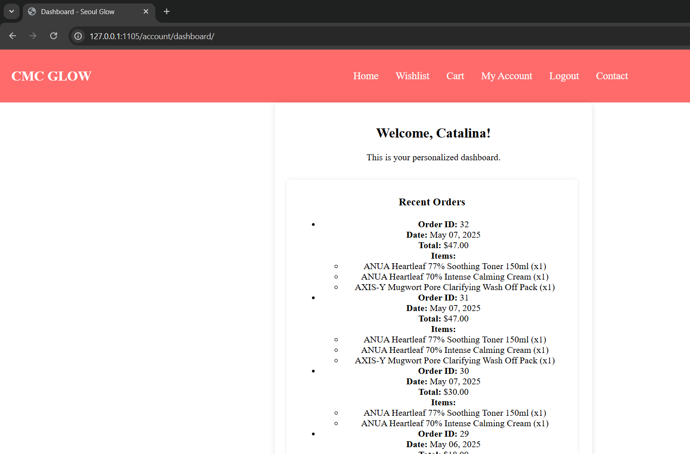
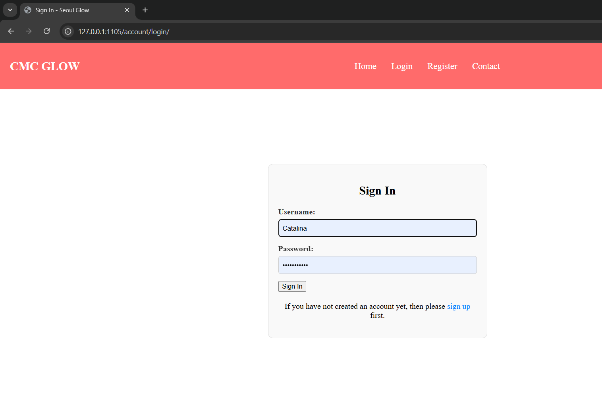
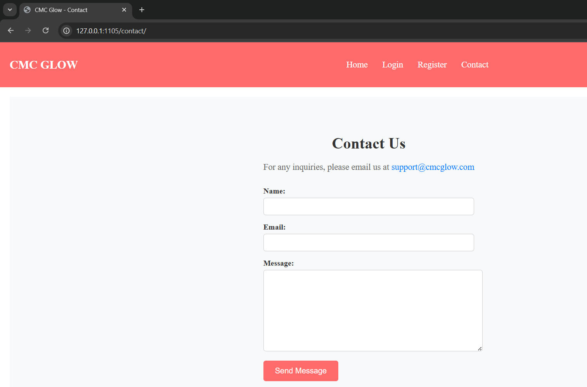

# 🌸 CMC GLOW – E-commerce Beauty & Skincare

An online store built with Django for selling authentic Korean skincare products.  
It includes user authentication, shopping cart, wishlist, order history, Stripe card payments, and Sameday delivery.

---

## 🔑 Features

- 👤 User registration and login
- 🔐 Secure authentication
- 🛒 Add/remove products from cart
- ❤️ Add/remove products from wishlist
- 💳 Checkout using Stripe
- 🧾 View order history
- 🚚 Integration with Sameday delivery
- 📝 Blog/articles system (optional)

---

## 🧪 Technologies Used

- **Backend:** Python, Django
- **Frontend:** HTML, CSS
- **Database:** SQLite 
- **Payments:** Stripe API
- **Delivery:** Sameday API

---

## 📦 Requirements

To run this project locally, install the dependencies:

```
pip install -r requirements.txt
🔧 Setup Instructions
Clone the repository:

Create and activate a virtual environment:

python -m venv venv
venv\Scripts\activate  # On Windows
Install dependencies:

pip install -r requirements.txt
Apply migrations and run the server:

python manage.py migrate
python manage.py runserver
Open in browser:
http://127.0.0.1:8000

📁 Project Structure
Beauty-Skincare/
├── accounts/            # User authentication and profiles
├── media/
├── products/            # Product and cart logic
├── screenshots/         # Screenshots for README
├── skincare_store/
├── static/              # CSS, JS, and images
│   └── images/
├── templates/           # HTML templates
├── venv/
├── manage.py
├── requirements.txt
└── README.md
## 📸 Screenshots

### 🏠 Home


### ❤️ Wishlist


### 🛒 Cart


### 👤 Account


### 🔓 Logout


### 📬 Contact

